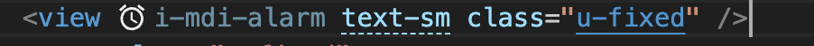

# vue3 + pinia + unocss + uviewplus

## 统一使用pnpm来install
nrm 添加https://packages.aliyun.com/5facfb4a2f8cc15c287b481b/npm/npm-registry/
```
 npm ---------- https://registry.npmjs.org/
  yarn --------- https://registry.yarnpkg.com/
  tencent ------ https://mirrors.cloud.tencent.com/npm/
  cnpm --------- https://r.cnpmjs.org/
  taobao ------- https://registry.npmmirror.com/
  npmMirror ---- https://skimdb.npmjs.com/registry/
* shuinfo ------ https://packages.aliyun.com/5facfb4a2f8cc15c287b481b/npm/npm-registry/
```


## pinia
pinia配置persist,会使用持久化保存（uniStorage）
```ts
import { defineStore } from 'pinia'

function store() {
  const username = ref('')
  const token = ref('')
  function setToken(value: string) {
    token.value = value
  }
  return {
    username,
    token,
    setToken,
  }
}

export const useUserStore = defineStore('user', store, {
  persist: {
    enabled: true,
  },
})
```

## unocss
[类名查询](https://unocss.dev/interactive/?s=background)
默认使用[mdi](https://icones.js.org/collection/mdi)图表


## uviewplus
暂时使用这个框架https://uiadmin.net/uview-plus/components/icon.html

## autoimport
vue相关方法和decloud相关方法都自动按需引入了，不需要import, easycom配置了uviewplus组件，也可直接使用

## todos
持续添加公共功能...


## 公共项目框架
基于uniapp创建，使用vue3开发
## 项目目录
```js
├─ api                              —— 接口配置中心
├─ components
│    ├─ swiper                      —— 轮播图公共组件
│    ├─ loading                     —— 全局loading
│    ├─ login-modal                 —— 首页登录按钮
│    ├─ nav-bar                    —— 自定义navbar
│    ├─ tab-bar                    —— 自定义tabbar
├─ page
│    ├─ index                       —— 首页
│    ├─ kitchen                     —— 灵感厨房
│    ├─ shopping                    —— 积分商城
│    ├─ newcamp                     —— 新品共创营
│    ├─ user                        —— 我的
└─ router
│    ├─ index.js                    —— 路由插件
├─ static                           —— 静态资源
├─ store
│    ├─ loading                    —— loading的方法
│    ├─ login                     —— 关于登录信息的存储
│    ├─ user                    —— 关于用户信息的存储
├─ utils
│    ├─ common                    —— 公共方法
      └─ goskip.js             —— 封装跳转的方法
      └─ storage.js             —— 存储的方法
      └─ upload.js             —— 上传图片的方法
      └─ url.js                —— 其他方法
│    ├─ login                —— 登录方法
│    ├─ request           —— request文件含有拦截器
└─ .editorconfig                    —— 编辑器代码风格统一配置
└─ .gitignore                       —— git提交过滤文件配置
└─ .prettierignore                  —— prettier文件忽略
└─ .prettierrc                      —— prettierrc代码格式配置
└─ index.html                       —— html入口
└─ commitlint.config.js             —— 代码提交风格配置
└─ main.js                          —— js文件入口
└─ vue.config.js                    —— 项目基础配置
└─ mainifest                        —— 项目信息基础配置中心
└─ package-lock.json                —— 版本依赖树
└─ package.json                     —— 项目信息，执行命令，依赖，钩子
└─ pages.json                       —— 路由，tabbar，全局样式配置
└─ README.md                        —— 说明文档
└─ uni.scss                         —— 全局样式
└─ App.vue                          —— vue入口文件
```
## 代码提交规范(commitlint + husky)
npx husky-init
npm install @commitlint/cli @commitlint/config-conventional -D
# 在根目录创建commitlint.config.js配置文件

module.exports = {
  extends: ['@commitlint/config-conventional'],
};
# 将commitlint加到husky的钩子中

npx husky add .husky/commit-msg 'npx --no-install commitlint --edit "$1"'
# 提交规范
```js
feat：新增功能
fix：bug 修复
docs：文档更新
style：不影响程序逻辑的代码修改(修改空白字符，格式缩进，补全缺失的分号等，没有改变代码逻辑)
refactor：重构代码(既没有新增功能，也没有修复 bug)
perf：性能, 体验优化
test：新增测试用例或是更新现有测试
build：主要目的是修改项目构建系统(例如 glup，webpack，rollup 的配置等)的提交
ci：主要目的是修改项目继续集成流程(例如 Travis，Jenkins，GitLab CI，Circle等)的提交
chore：不属于以上类型的其他类，比如构建流程, 依赖管理构建过程或辅助工具的变动
revert：回滚某个更早之前的提交
```
# 示例

git commit -m 'fix: 修复xxx页面跳转异常'

# 插件
```js
"@commitlint/cli": "^17.6.7";
"@commitlint/config-conventional": "^17.6.7";
"uni-mini-router": "^0.1.4";//使用此插件，路由跳转可以使用vue的方法，官网为https://ask.dcloud.net.cn/article/40552
"prettier": "^3.0.1";
"sass": "^1.66.1";
"sass-loader": "^10.4.1"
